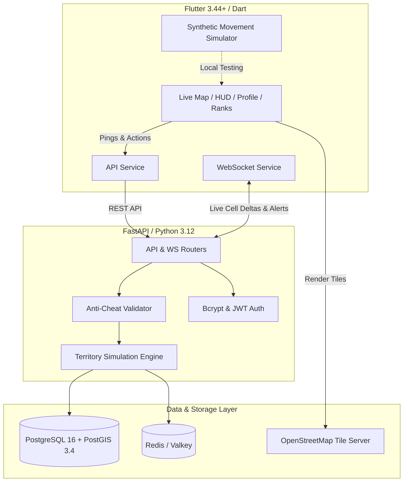

<div align="center">

# 🏃‍♂️ TERRITORY RUN 🗺️

**Real-World GPS Hexagon Conquest Game**

*Turn your everyday runs, jogs, and walks into tactical territory conquest on a live world map.*

[](https://fastapi.tiangolo.com)
[](https://flutter.dev)
[](https://www.postgresql.org)
[](https://postgis.net)
[](https://h3geo.org)
[](LICENSE)

[Live Demo](http://127.0.0.1:3000) • [Architecture](#-architecture) • [Core Game Rules](#-core-game-rules) • [API Reference](#-api-endpoints) • [Quickstart](#-quickstart-guide)

---

</div>

## 📖 Overview

**Territory Run** is a location-based fitness strategy game where your physical movement in the real world claims territory on an interactive hexagon grid. Other players can contest and conquer your zones by moving through them with greater frequency or speed.

- 📱 **Cross-Platform Client**: Built with Flutter (iOS, Android, and Web support).
- 🗺️ **100% Free & Open-Source Map Engine**: Powered by `flutter_map` and OpenStreetMap tile servers with zero vendor API billing or license lock-in.
- ⚡ **High-Performance Geospatial Backend**: FastAPI with PostGIS spatial indexing, Redis caching, and real-time WebSockets.
- 🛡️ **Server-Side Anti-Cheat**: Hardened speed limits and path continuity checks.

---

## 📐 Core Game Rules

The game engine implements mathematical territorial mechanics:

### 1. Spatial Tiling
The Earth's surface is tessellated into **Uber H3 hexagonal cells** at **resolution 9**:
- **Edge length:** ≈ 174 meters
- **Cell area:** ≈ 0.1 km² (109,400 m²)

### 2. Scoring Formula
When a player traverses an H3 cell, score accumulates according to:

$$
\text{score} += \text{visit weight}(\text{activity}) \times \text{recency decay}(\Delta t)
$$

| Activity Type | Multiplier Weight | Description |
|---|---|---|
| **Walk** | `1.0x` | Standard pedestrian pace (≤ 6 km/h) |
| **Jog** | `1.3x` | Moderate aerobic pace (≈ 7 – 10 km/h) |
| **Run** | `1.6x` | High aerobic exertion (≈ 10 – 25 km/h) |

### 3. Exponential Recency Decay (14-Day Half-Life)
Defensive scores decay organically over time, encouraging regular active defense:

$$
\text{recency decay}(\Delta t) = 2^{-\frac{\Delta t}{t_{1/2}}}
$$

- **Half-life ($t_{1/2}$):** 14 days (1,209,600 seconds)
- **At Day 0:** Factor = 1.000
- **At Day 7:** Factor ≈ 0.7071
- **At Day 14:** Factor = 0.5000 (decayed by 50%)
- **At Day 28:** Factor = 0.2500

### 4. 15% Ownership Hysteresis Buffer
To eliminate rapid flickering caused by GPS jitter or parallel runners, a challenger must definitively exceed the defending owner's score by **15%**:

$$
\text{Score}_{\text{challenger}} > 1.15 \times \text{Score}_{\text{current owner}}
$$

> **Takeover Rule:** A challenger only captures defending territory if their accumulated score strictly exceeds **115%** of the current owner's active score (`Score_challenger > 1.15 * Score_current_owner`).

### 5. Real-Time Displacement Alerts
When an ownership flip occurs:
1. The cell's polygon color updates live on the map for all connected subscribers.
2. An instant push alert and notification feed item is dispatched to the displaced player: *"Your territory at cell ... was captured by Bob!"*

---

## 🛡️ Anti-Cheat Integrity Engine

All game scores are computed exclusively **server-side** from raw GPS telemetry pings:

- 🚫 **Speed Ceiling**: GPS segments implying sustained pedestrian speeds > 25.0 km/h are rejected to prevent driving or cycling spoofing.
- 🚫 **Teleportation Defense**: Consecutive route pings must pass continuously through adjacent neighboring H3 cells (`grid_distance <= 1`). Discontinuous teleport jumps are rejected.
- 🚫 **Timestamp Monotonicity**: Rejects chronologically disordered or time-warped coordinates.

---

## 🏛️ System Architecture



---

## 📁 Repository Structure

```
Territory Run/
├── DECISIONS.md                   # Architectural parameters & defaults
├── docker-compose.yml             # Full-stack infra (PostGIS + Redis + FastAPI)
├── README.md                      # Project documentation
├── backend/
│   ├── Dockerfile                 # Backend container image
│   ├── init.sql                   # PostGIS SQL Schema matching §4
│   ├── requirements.txt           # Python backend dependencies
│   ├── validate_phase0.py         # Phase 0 math validation runner
│   ├── app/
│   │   ├── config.py              # Application settings (Pydantic)
│   │   ├── main.py                # FastAPI entry point & CORS
│   │   ├── core/
│   │   │   ├── territory_math.py  # H3 math, decay & hysteresis
│   │   │   ├── anti_cheat.py      # Anti-cheat speed & jump validators
│   │   │   ├── engine.py          # Territory state recalculation engine
│   │   │   └── security.py        # Bcrypt hashing & JWT utilities
│   │   ├── db/
│   │   │   └── storage.py         # Spatial store & WebSocket manager
│   │   ├── schemas/               # Request & response Pydantic models
│   │   └── api/
│   │       ├── auth.py            # /auth/register, /auth/login
│   │       ├── players.py         # /players/me (GET, PATCH)
│   │       ├── routes.py          # /routes/start, /ping, /end
│   │       ├── territory.py       # /territory/cells, /territory/cell/{h3}
│   │       ├── leaderboard.py     # /leaderboard/{scope}
│   │       ├── notifications.py   # /notifications
│   │       └── websocket.py       # /ws/map/{bbox}, /ws/player/{id}
│   └── tests/
│       ├── test_phase0_territory_math.py # Geospatial math & decay test suite
│       └── test_api_mvp.py               # Full MVP API integration test suite
└── mobile/
    ├── pubspec.yaml               # Flutter dependencies (flutter_map, etc.)
    ├── lib/
    │   ├── main.dart              # Flutter application entry & routing
    │   ├── theme/
    │   │   └── app_theme.dart     # Cyberpunk / Tactical dark theme
    │   ├── config/
    │   │   └── api_constants.dart # API & WebSocket base URLs
    │   ├── models/                # Territory, Player, Alert, Leaderboard models
    │   ├── services/              # API, WebSocket & Location services
    │   ├── providers/             # AuthProvider & GameProvider
    │   └── screens/
    │       ├── auth_screen.dart            # Login & Register + Banner Color
    │       ├── main_navigation_screen.dart # Bottom navigation with unread badges
    │       ├── live_map_screen.dart        # Fullscreen map, H3 polygons, HUD
    │       ├── leaderboard_screen.dart     # Local, City, Country, Global ranks
    │       ├── notifications_screen.dart   # Territory captured alert feed
    │       └── profile_screen.dart         # Callsign, area stats, color picker
    └── test/
        └── widget_test.dart       # Client widget smoke tests
```

---

## 🔌 API Endpoints

### Authentication
- `POST /auth/register` — Create player with callsign, email, password, and banner color.
- `POST /auth/login` — Authenticate and receive JWT bearer token.

### Player Profile
- `GET /players/me` — Fetch authenticated player profile and area metrics.
- `PATCH /players/me` — Update player callsign or territory banner color.

### Routes & Tracking Telemetry
- `POST /routes/start` — Start a new tracked session (returns `route_id`).
- `POST /routes/{route_id}/ping` — Submit batch of GPS points `[{lat, lng, timestamp}, ...]`. Triggers H3 snapping, contest scoring, ownership flips, and live WebSocket broadcasts.
- `POST /routes/{route_id}/end` — Finalize route, compute distance and captured cell counts.

### Territory Queries
- `GET /territory/cells?bbox={minLng,minLat,maxLng,maxLat}` — Query owned territory polygons inside map viewport.
- `GET /territory/cell/{h3_index}` — Retrieve cell ownership details and leaderboard of contestants.

### Leaderboards & Alerts
- `GET /leaderboard/{scope}` — Scopes: `local | city | country | global`. Ranked by total claimed territory area.
- `GET /notifications` — Retrieve displaced territory alerts.
- `POST /notifications/{id}/read` — Mark alert as read.

### Realtime WebSockets
- `WS /ws/map/{bbox}` — Real-time viewport stream pushing ownership flips and color deltas.
- `WS /ws/player/{player_id}` — Direct push stream for personal territory loss alerts.

---

## 🚀 Quickstart Guide

### Prerequisites
- Python 3.12+
- Flutter SDK 3.22+ (stable channel)
- Git

### 1. Setup Backend
```powershell
# Clone the repository
git clone https://github.com/Anshi-2004/Territory-Run.git
cd "Territory Run"

# Create Python virtual environment
python -m venv .venv

# Activate virtual environment
# Windows PowerShell:
.\.venv\Scripts\Activate.ps1
# Linux/macOS:
# source .venv/bin/activate

# Install dependencies
pip install -r backend/requirements.txt

# Start FastAPI server
$env:PYTHONPATH="backend"
uvicorn app.main:app --host 127.0.0.1 --port 8000 --reload
```
- API Documentation: [http://127.0.0.1:8000/docs](http://127.0.0.1:8000/docs)
- Health Check: [http://127.0.0.1:8000/health](http://127.0.0.1:8000/health)

### 2. Run Test Suites
```powershell
# Run backend pytest suite (all 8 integration & math tests)
$env:PYTHONPATH="backend"
pytest backend/tests

# Run Flutter mobile tests
cd mobile
flutter test
```

### 3. Run Mobile Client
```powershell
cd mobile

# Run in Chrome (Web Preview)
flutter run -d chrome

# Run on connected Android device / emulator
flutter run -d android
```

### 4. Full Infrastructure Deployment (Docker Compose)
To run the full stack with PostgreSQL 16 + PostGIS 3.4 and Redis:
```powershell
docker compose up --build
```

---

## 🗺️ Mobile App Screens (§8)

| Screen | Description |
|---|---|
| **1. Auth Screen** | Clean dark login/register interface with custom callsign and interactive 8-color conquest banner picker. |
| **2. Live Map** | Interactive OSM tiles displaying owned H3 hexagon polygons painted in live player colors, player GPS indicator, and active route polyline. |
| **3. Active Session HUD** | Real-time tracking panel displaying elapsed duration (`mm:ss`), distance in meters, cells conquered, pace rate multiplier, and finish button. Includes a built-in synthetic pedestrian movement simulator for seamless desktop/web testing. |
| **4. Sector Leaderboards** | Ranked standings across **Local**, **City**, **Country**, and **Global** scopes with gold/silver/bronze podium badges and area metrics in km² and m². |
| **5. Intel & Alerts** | Real-time displaced notification feed alerting players when their territory is captured by a challenger. |
| **6. Commander Profile** | Profile card, total territory conquest statistics, war coins, and dynamic banner color customizer. |

---

## 🗺️ Roadmap

- [x] **Phase 0:** H3 + PostGIS territory math validated against synthetic GPS data.
- [x] **Phase 1 (MVP):** Full auth, live map with OSM tiles, H3 hexagon rendering, 15% hysteresis takeover, leaderboards, displaced push alerts, anti-speed cheat engine.
- [ ] **Phase 2:** Clans/factions, friend challenges, territory missions, achievement badges.
- [ ] **Phase 3:** Coin economy, cosmetic banners/trails, running conquest streaks.
- [ ] **Phase 4:** Background tracking service, regional sharding, device step-counter telemetry.
- [ ] **Phase 5:** Multi-region cloud scaling, seasonal tournaments, competitive leagues.

---

## 📄 License

This project is licensed under the [MIT License](LICENSE).
OpenStreetMap tiles are provided under the [Open Database License (ODbL)](https://www.openstreetmap.org/copyright).
